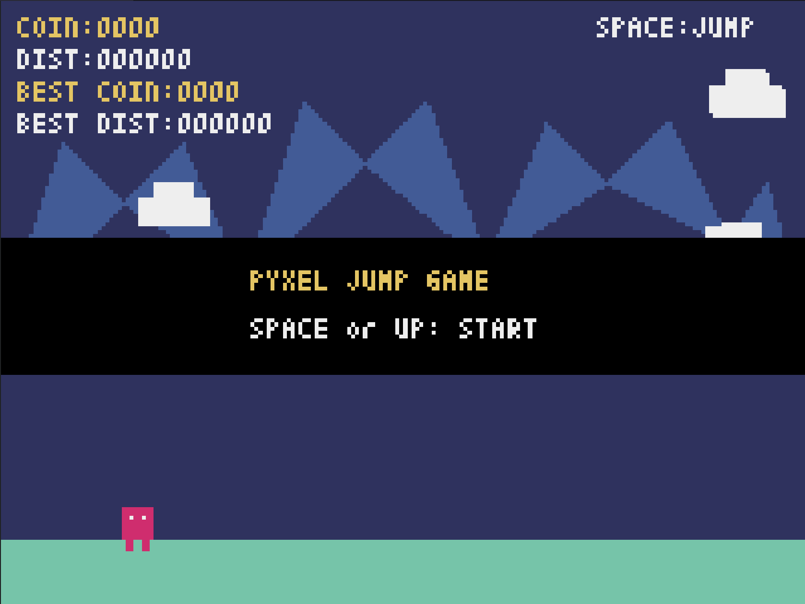
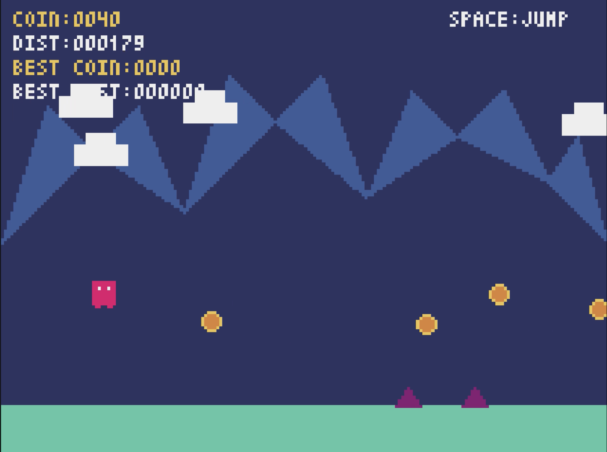
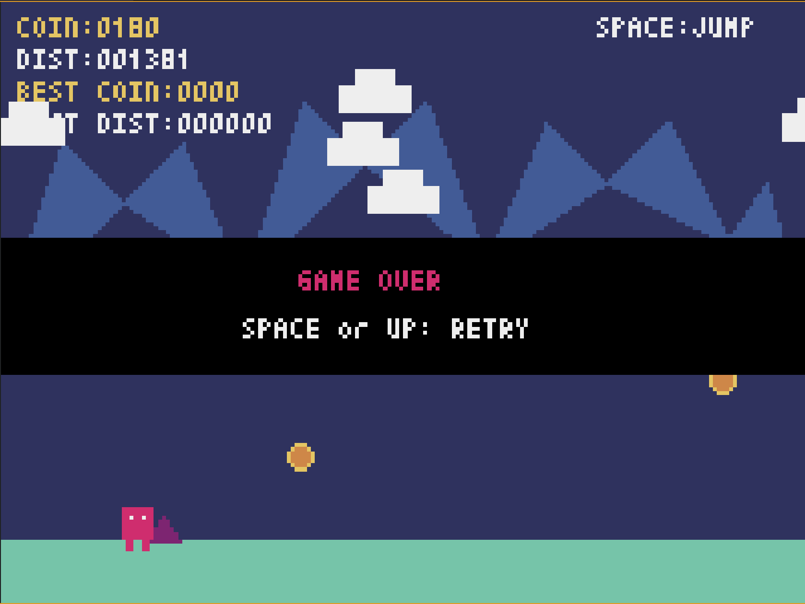

# 🎮 Pyxel Jump Game

Pythonのレトロゲームエンジン「Pyxel」で作った横スクロールジャンピングゲームです。


---

## 🖼️ スクリーンショット

| タイトル | プレイ中 | ゲームオーバー |
|:---:|:---:|:---:|
|  |  |  |

---

## 🕹️ ゲーム内容

- 自動横スクロールでひたすら走り続ける
- トゲ（スパイク）を避けてコインを集めよう
- **2段ジャンプ**対応！空中でもう一度ジャンプできる

| 要素 | 説明 |
|---|---|
| 🔴 赤いキャラ | プレイヤー |
| 🔺 紫のトゲ | 触れるとゲームオーバー |
| 🟡 コイン | 取ると +10点 |

---

## 📊 スコア仕様

| 表示 | 内容 |
|---|---|
| `COIN` | コイン取得数（1枚 +10） |
| `DIST` | 走った距離 |
| `BEST COIN` | 過去最高コインスコア |
| `BEST DIST` | 過去最長距離 |

---

## ⌨️ 操作方法

| キー | 動作 |
|---|---|
| `Space` / `↑` | ジャンプ（2段ジャンプ対応） |
| `Q` | 終了 |

---

## 🚀 セットアップ

### 必要環境
- Python 3.x
- VSCode + [Pyxel拡張機能](https://marketplace.visualstudio.com/items?itemName=kitao.pyxel-vscode)

### インストール

```bash
git clone https://github.com/nori77-log/pyxel-jump-game.git
cd pyxel-jump-game

python -m venv .venv

# Windows
.venv\Scripts\activate
# Mac/Linux
source .venv/bin/activate

pip install -r requirements.txt
```

---

## ▶️ 実行方法

### VSCode拡張機能（推奨）
1. `jump_game.py` を VSCode で開く
2. コマンドパレット（`Ctrl+Shift+P`）
3. `Pyxel: Run Script` を実行

### ターミナル
```bash
python jump_game.py
```

---

## 📁 フォルダ構成

```
pyxel-jump-game/
├── jump_game.py      # メインスクリプト
├── requirements.txt  # 依存パッケージ
├── .gitignore
├── README.md
└── assets/
    └── screenshots/  # スクリーンショット
        ├── start.png
        ├── play.png
        └── gameover.png
```

---

## 🔗 参考サイト

| サイト名 | 説明 | リンク |
|---|---|---|
| 窓の杜 - Pyxelレビュー | Pyxelの導入手順・サンプル解説記事 | [リンク](https://forest.watch.impress.co.jp/docs/review/1156902.html) |
| 窓の杜 - VSCode拡張機能 | PyxelのVSCode公式拡張機能の紹介記事 | [リンク](https://forest.watch.impress.co.jp/docs/news/2092632.html) |
| Pyxel GitHub | Pyxel公式リポジトリ・ドキュメント | [リンク](https://github.com/kitao/pyxel) |
| Visual Studio Marketplace | Pyxel VSCode拡張機能のダウンロードページ | [リンク](https://marketplace.visualstudio.com/items?itemName=kitao.pyxel-vscode) |

---

## 📜 ライセンス

MIT License